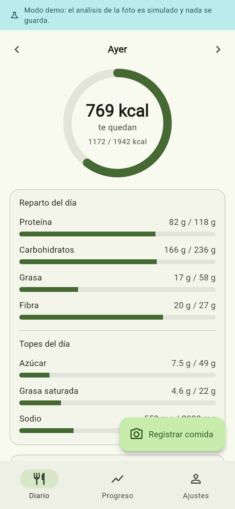
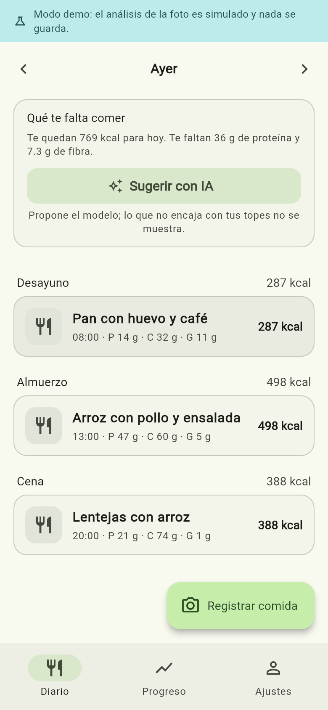
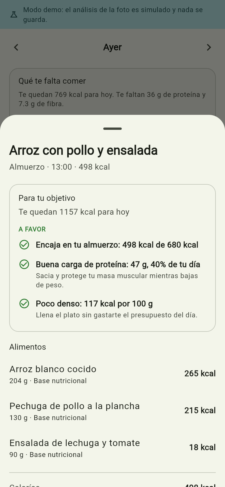
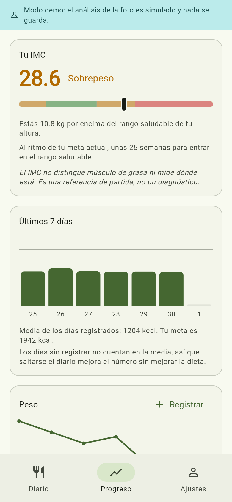

# Mi Plato

[English](README.md) · **Español**

Diario de alimentación por foto. Fotografías el plato, la app reconoce los
alimentos, calcula las calorías y te dice qué juega a favor y qué en contra de
tu IMC y de tu objetivo.

Flutter (Android, iOS y web) + Supabase + Claude para el reconocimiento.

<p align="center">
  
  
  
  
</p>

<p align="center"><sub>Resumen del día · comidas · veredicto de una comida · IMC y progreso semanal (modo demo)</sub></p>

## Cómo está repartido el trabajo

Esta es la decisión de diseño que sostiene todo lo demás:

| Quién | Qué hace |
|---|---|
| **Modelo de visión** (Claude, en el servidor) | Mirar la foto: qué alimentos hay y cuántos gramos de cada uno |
| **Base nutricional** (USDA FoodData Central) | Los gramos de proteína, grasa, sodio… medidos en laboratorio |
| **La app** (Dart puro, `lib/datos/nutricion/`) | IMC, gasto energético, meta diaria, el veredicto de pros y contras, y el filtro de las sugerencias |

El modelo no opina sobre tu dieta. Solo identifica comida. Todo consejo sale de
reglas fijas contrastables contra un umbral concreto (OMS, Mifflin-St Jeor,
Dietary Guidelines), así que dos platos iguales reciben siempre el mismo
veredicto y cada frase se puede rastrear hasta su fórmula. Eso es lo que hacen
`calculos.dart` y `veredicto.dart`, y por eso están cubiertos por tests.

## Arrancar sin backend (modo demo)

```bash
flutter run
```

Sin credenciales la app entra en modo demo: datos en memoria, análisis de foto
simulado y una cuenta de ejemplo con una semana de registros. Sirve para
recorrer la interfaz entera; no reconoce fotos de verdad.

En la pantalla de entrada, toca **Entrar en modo demo**.

## Configurar el backend

### 1. Base de datos

Crea un proyecto en [supabase.com](https://supabase.com) y ejecuta
`supabase/schema.sql` completo en el SQL Editor. Deja el bucket `comidas` como
lo crea el script: **privado**. Son fotos de lo que alguien come en su casa.

### 2. Edge Function

```bash
supabase secrets set ANTHROPIC_API_KEY=sk-ant-...
supabase secrets set FDC_API_KEY=...        # gratis: https://fdc.nal.usda.gov/api-key-signup
supabase functions deploy analizar-comida
supabase functions deploy sugerir-comidas
```

`FDC_API_KEY` es opcional. Sin ella la app funciona, pero los nutrientes son la
estimación del modelo en vez de datos medidos, y cada alimento aparece marcado
como tal.

**La clave de Anthropic nunca va en el cliente.** Vive como secreto de la
función; la app solo manda la imagen. Si estuviera en el APK, cualquiera podría
extraerla y gastar con ella.

### 3. Ejecutar

```bash
flutter run --dart-define=SUPABASE_URL=https://xxx.supabase.co --dart-define=SUPABASE_ANON_KEY=eyJ...
```

## Estructura

```
lib/
  core/        config, tema, rutas, formatos
  datos/
    modelos/   dominio (Perfil, Comida, Alimento, Nutrientes)
    nutricion/ IMC, meta diaria, veredicto, tabla local  <- el núcleo
    repos/     interfaces + Supabase + almacén demo
  estado/      providers de Riverpod
  ui/          auth, diario, cámara, progreso, ajustes
supabase/
  schema.sql                     tablas, RLS, bucket, cuota y borrado
  functions/analizar-comida/     reconocimiento de la foto
  functions/sugerir-comidas/     qué comer en lo que queda del día
docs/decisiones/                 ADRs: por qué está hecho así
```

## Tus datos

Un diario de comidas y una curva de peso son datos de salud, y el proyecto los
trata como tales:

- **Nadie más los ve.** Cada tabla lleva RLS por `auth.uid()` y no existe un rol
  administrador con acceso al diario ajeno. El bucket de fotos es privado: la
  app guarda la ruta y firma un enlace temporal para mostrarla.
- **Te los puedes llevar.** Ajustes -> *Exportar mis datos* vuelca todo en JSON,
  con los valores derivados (IMC, meta, topes) incluidos para que se entiendan
  sin la app.
- **Los puedes borrar.** Ajustes -> *Borrar mi cuenta y mis datos* elimina el
  perfil, las comidas, las fotos y el historial de peso. Borrar una comida
  suelta borra también su foto: Storage no participa en las cascadas de
  Postgres, así que la app lo hace explícitamente y en ese orden.
- **Retención**: hasta que decidas borrarlo. No hay caducidad automática, porque
  un diario sin historial no sirve para nada.

## Coste y límites

Cada análisis es una llamada a Claude con una imagen de 1280 px (~1600 tokens
de entrada) más unos cientos de salida: del orden de un céntimo de dólar por
foto. La app reduce la imagen antes de subirla precisamente por esto.

Las sugerencias de qué comer son solo texto, así que cuestan una fracción de
eso, y solo se generan cuando alguien pulsa el botón.

Los topes diarios por persona se cuentan en Postgres (`consumir_cuota()`), no en
las Edge Functions: el límite es una constante de la función SQL, así que no se
puede saltar llamando al RPC a mano. Son 30 análisis de foto y 20 tandas de
sugerencias al día, contados por separado para que gastar en uno no deje sin el
otro. Al agotarse, la app sigue funcionando con la tabla local, que no cuesta
nada.

## Tests

```bash
flutter test
```

82 tests sobre la lógica que produce los números y sobre lo que toca datos
personales: fórmulas del IMC y del gasto, los topes que endurecen las
condiciones médicas, cada regla del veredicto, el almacén del diario, el
formato de exportación y el orden del borrado (las fotos siempre antes que la
cuenta).

## Decisiones

Las decisiones que costaría caro revertir están en `docs/decisiones/`, con las
alternativas que se descartaron y por qué:

| ADR | Decisión |
|---|---|
| 0001 | El veredicto lo calculan reglas fijas, no el modelo |
| 0002 | Los alimentos se congelan dentro de la comida (jsonb) |
| 0003 | El tope de análisis se cuenta en Postgres |
| 0004 | La app arranca en modo demo cuando faltan credenciales |
| 0005 | Los líquidos se anotan en mililitros y se guardan en gramos |
| 0006 | En las sugerencias el modelo propone y las reglas disponen |

## Lo que esta app no es

- **La porción es una estimación.** De una foto plana no se deduce el volumen.
  El error habitual ronda el 20-30%, y por eso la pantalla de revisión deja
  corregir la cantidad antes de guardar: en gramos lo sólido y en mililitros las
  bebidas, que es como vienen rotuladas. Sirve para ver tendencias, no para una
  pauta clínica.
- **El IMC no distingue músculo de grasa.** Es una referencia de partida.
- **Los topes son de población adulta sana.** Las condiciones que se marcan en
  el perfil los endurecen, pero no sustituyen a un profesional de salud.
